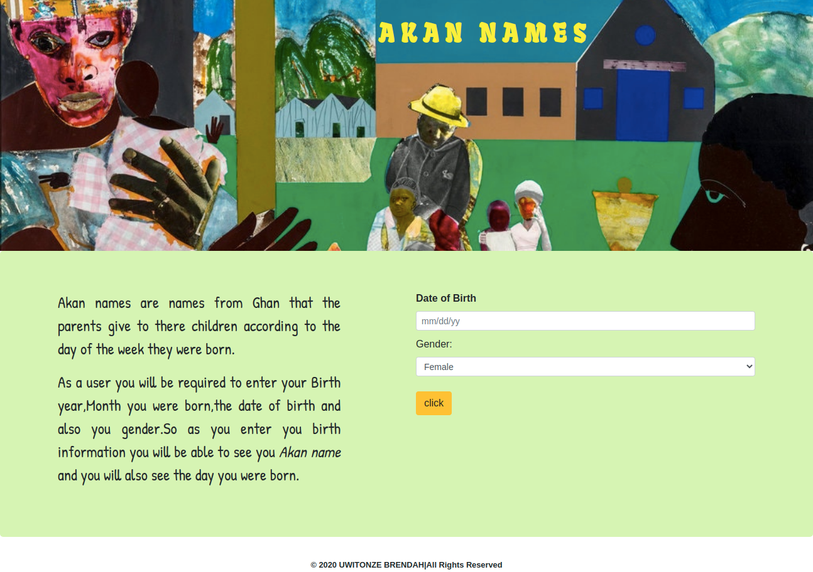

# AKAN-NAMES

## Description

This is a website Application that allows user to enter their birth information and get to know the day of birth and see the Akan names which are derived from Ghana ; This names are given by parents to their children according to the day they where born.

### AUTHOR'S INFORMATION

[brendahuwitonze](https://github.com/brendahuwitonze)

## Setup/Installation Requirements

* installation of ubuntu
* installing git
* signing up to github 
* visual studio code

####  Behaviour Driven Development (BDD)

* Enter Month-of-birth(mm)
* Enter Date-of-month(dd)
* Enter Year-of-birth
* select Gender(female/male)
* click on check
* See your Akan name

 ## Technologies Used

* JAVASCRIPT(JS)
* HYPERTEXT-MARKUP LANGUAGE(HTML)
* CASCADING-STYLE-SHEET(CSS)
* MARKDOWN

## Image

 

  ## here is the link 
[Akan-name](https://brendahuwitonze.github.io/Akan-names/.)

## License

Permission is hereby granted, free of charge, to any person obtaining a copy
of this software and associated documentation files (the "Software"), to deal
in the Software without restriction, including without limitation the rights
to use, copy, modify, merge, publish, distribute, sublicense, and/or sell
copies of the Software, and to permit persons to whom the Software is
furnished to do so, subject to the following conditions:

The above copyright notice and this permission notice shall be included in all
copies or substantial portions of the Software.

THE SOFTWARE IS PROVIDED "AS IS", WITHOUT WARRANTY OF ANY KIND, EXPRESS OR
IMPLIED, INCLUDING BUT NOT LIMITED TO THE WARRANTIES OF MERCHANTABILITY, 
FITNESS FOR A PARTICULAR PURPOSE AND NONINFRINGEMENT. IN NO EVENT SHALL THE
AUTHORS OR COPYRIGHT HOLDERS BE LIABLE FOR ANY CLAIM, DAMAGES OR OTHER
LIABILITY, WHETHER IN AN ACTION OF CONTRACT, TORT OR OTHERWISE, ARISING FROM, 
OUT OF OR IN CONNECTION WITH THE SOFTWARE OR THE USE OR OTHER DEALINGS IN THE
SOFTWARE.}
Copyright (@) {2020} {UWITONZE BRENDAH}
